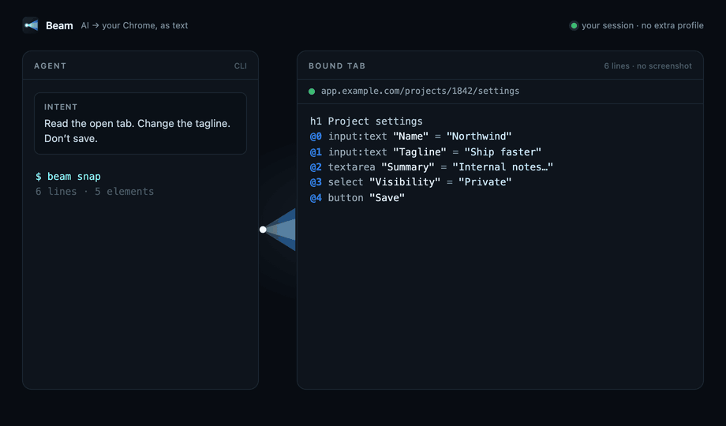

# Beam

Chrome control for CLI agents, **as text**. Beam reads a page's structure and
acts on the DOM — no screenshots to decode, no debugging protocol, no separate
profile. It works in your own Chrome, in the session you are already logged
into.

<p align="center">
  
</p>

```
agent / you ──► beam (CLI) ──► local hub :8777 ──► extension ──► page
        compact text ◄──────────────────────────────────────── DOM
```

A WordPress admin screen comes back as ~40 lines of text instead of a
screenshot:

```
$ beam snap
Edit page · WP
https://example.com/wp-admin/post.php?post=1420&action=edit
9 elements

h1 Edit page
@0 input:text "Title" = "Woven roots" #title
@1 input:text "Kicker" = "New collection 2026"
@2 textarea "Description" = "There is a moment…" *
@3 select "Status" = "Published" {Draft|Published}
@4 input:checkbox "Active" = "off"
@6 editable "Notes" = "rich text" #rich
@7 link "All pages" -> /wp-admin/edit.php
@8 button "Update" #publish
```

Then you write to it in one round trip:

```bash
beam set '{"label=Kicker":"New collection 2026","name=acf[field_bb]":"Woven roots"}'
```

It was built to be driven by [Claude Code](https://claude.com/claude-code) — the
repo ships two skills — but the CLI is plain Node and works on its own.

## Install

From npm:

```bash
npm install -g beam-chrome
bash "$(npm root -g)/beam-chrome/install.sh"
```

or from a clone:

```bash
git clone https://github.com/darksns/beam.git
cd beam
bash install.sh
```

The installer prints the path of the `extension/` folder to load.

Then, once, in Chrome:

1. open `chrome://extensions`
2. turn on **Developer mode**
3. **Load unpacked** → the `extension/` folder of this repo

Check it: `beam tabs`.

Load **one** copy of the extension only. If two are loaded (a leftover folder
and this repo), the last one to connect takes the hub; the leftover panel says
**Another copy is connected** and stops retrying, instead of the two copies
stealing the socket from each other.

The installer links `beam` and `beam-mdconv` into `~/.local/bin`, creates
`~/.beam/` (hub token and site adapters) and, if Claude Code is installed, links
the two skills into `~/.claude/skills/`. The hub starts by itself on every
command. The toolbar icon opens a panel with the connection state, the port, the
bound tab and two buttons: **Reconnect** and **Release tab**; a red `!` on the
icon means the connection dropped.

Requires Node 18+ and Chrome (or any Chromium with MV3 extensions).

## Use

```bash
beam open https://example.com/wp-admin/post.php?post=1420&action=edit
beam snap
beam fields --json
beam set --dry @payload.json     # preview the diff
beam set @payload.json
```

`open` works in a separate Chrome window that stays unfocused, and reuses one
tab. `beam focus` brings that window forward.

Read: `snap` · `outline` · `fields` · `text` · `html` · `info` · `tabs` · `frames`
Act: `open` · `focus` · `nav` · `click` · `hover` · `fill` · `select` · `check` · `press` · `upload` ·
`set` · `do` · `wait` · `scroll` · `shot`

Targets are `@12` (a ref from the last snap), `@3:12` (ref 12 inside frame 3),
`css=.klass`, `text=Update`, `label=Title`, `name=post_title`.

`beam help` has the full list; `skills/beam/SKILL.md` is the reference an agent
reads, and `skills/web-publish/` covers content work inside a CMS.

## How it is built

| piece | file | job |
|---|---|---|
| CLI | `bin/beam` | builds the command, sends it over HTTP, formats the answer |
| converter | `bin/beam-mdconv` | Markdown → Gutenberg blocks / HTML / text |
| hub | `server/server.js` | HTTP for the CLI, WebSocket for Chrome. 127.0.0.1 only, executes nothing |
| service worker | `extension/background.js` | holds the socket, manages tabs, injects the agent |
| agent | `extension/agent.js` | lives in the isolated world: reads the structure, acts on the DOM |
| page shim | `extension/shim.js` | MAIN world: TinyMCE / jQuery / Select2, reached from the agent via the DOM |
| panel | `extension/popup.html` · `popup.js` | connection state and quick commands |

The agent exposes a **closed** set of operations (snap, outline, fields, text,
html, click, hover, fill, set, select, check, press, scroll, wait, upload, do). There is
no path to running arbitrary code in the page.

**Adapters** in `~/.beam/adapters/<host>.json` are notes on how a given
backoffice is driven; the `web-publish` skill uses them so the same panel is
never explored twice. `examples/adapters/` has a commented one.

## Why it is fast

- One `snap` of an admin screen is ~40 lines of text instead of an image.
- `set` and `do` perform dozens of operations in a single round trip.
- `@n` refs avoid repeating long selectors.

## Security

Beam drives a browser that is logged into your accounts, so the doors are shut
by default — see [SECURITY.md](SECURITY.md) for the details.

- The hub binds to `127.0.0.1`, executes nothing, and relays messages only.
- `/cmd` requires the token in `~/.beam/token` (0600, generated on first run)
  and refuses any request carrying browser fetch metadata: **a web page cannot
  drive your browser through this port.**
- The WebSocket only accepts an `Origin` of `chrome-extension://…`; set
  `BEAM_EXTENSION_ID` to pin one specific extension. A second copy with a
  different id takes over and the leftover is told to stop retrying.
- The hub pings the extension every 15s and drops a socket that stops
  answering, so a dead service worker fails the next command immediately
  instead of making it wait out its timeout.
- Beam refuses to write if the bound tab was moved elsewhere by the person: it
  reports first, `--force` second.
- The extension asks for `<all_urls>`, like any automation extension. To narrow
  it, list only the domains you need in `host_permissions`.
- Saving, publishing and submitting forms stay actions an agent asks about
  first: that rule is written into both skills.

## Test

```bash
npm install     # jsdom, for the agent tests
npm test
```

`test/agent.test.js` runs the agent against a simulated ACF DOM:
snap, fields, fill by label/name/ref, select, check, contenteditable, bulk and
`--dry` set, input/change events, frame-prefixed refs, the style fallback when a
tab has no layout, outline, `do` sequences, `wait`, escaped `cssPath`, TinyMCE
and jQuery through the page shim.
`test/hub.test.js` starts a real hub, pretends to be the extension, and checks
the handshake, WebSocket framing up to 200 KB payloads, that an unauthorized
or page-originated request is refused, that a leftover copy is told it was
replaced, and that a silent socket is dropped instead of timing out.

## Contributing

Issues, site adapters and pull requests are welcome — start from
[CONTRIBUTING.md](CONTRIBUTING.md). Questions and ideas go in
[Discussions](https://github.com/darksns/beam/discussions).

## License

MIT — see [LICENSE](LICENSE).
